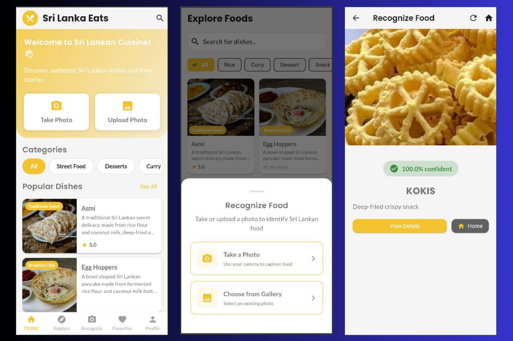

# 🍽️ Sri Lanka Eats – AI Food Recognition App

Sri Lanka Eats is an **AI-powered mobile application** that recognizes traditional Sri Lankan food items and provides rich **cultural and culinary information** to users.  
This project supports **gastronomy tourism** and **digital cultural preservation** by combining **deep learning**, a **scalable backend**, and a **modern mobile interface**.

---

## 🚀 Key Highlights

- 🤖 AI-based food recognition using **MobileNetV2**
- 🎯 Achieved **97% classification accuracy** after fine-tuning
- 🛠️ Built with **TensorFlow, Keras, FastAPI, Flutter, and MongoDB**
- 🔐 Secure authentication with **Email/Password & Google Login**
- ⭐ User features include:
  - Food details & cultural insights  
  - Reviews & ratings  
  - Favorites management  

---

## 🧠 Tech Stack

### AI / Machine Learning
- TensorFlow  
- Keras  
- MobileNetV2  

### Backend
- FastAPI  
- MongoDB  
- JWT Authentication  
- Google OAuth  

### Mobile Application
- Flutter (Dart)
  
---

## 🎯 Project Purpose

- Help **tourists and locals** identify Sri Lankan foods
- Provide **cultural and culinary knowledge**
- Promote **local cuisine** using intelligent mobile technology
- Preserve Sri Lanka’s **food heritage digitally**

